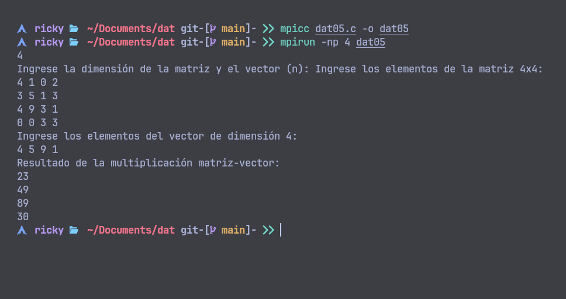
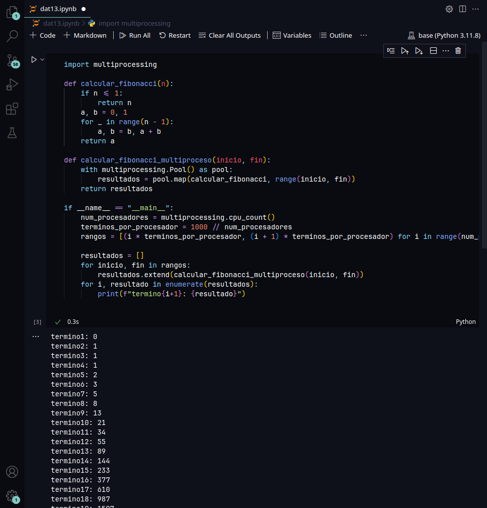

# Dat-241
1. En C implemente las funciones básicas (+.‐.*./); utilice punteros (Ej. Multiplicación en basea sumas, división con base en restas).
**se compila:**

```bash 
gcc -o dat01 dat01.c

```
**se ejecuta:**
```bash
./dat01
```

 

2. Lleve el anterior código en c++.  

**se compila:**
```bash
c++ dat02.cpp -o dat02
```

**se ejecuta:**

```bash
./dat02
```
 

3. En openMP realice la multiplicación y división en base a sumas y restas.
**se compila:**

```bash
gcc -fopenmp dat03.c -o dat03
```

**se ejecuta:**

```bash
./dat03
```
 

4. Realizar en OPENMP la multiplicación de una matriz NxN, con un vector de dimensión N.

**se compila:**
```bash
gcc -fopenmp dat04.c -o dat04
```

**se ejecuta:**

```bash
./dat04
```
 

5. Realizar en MPI la multiplicación de una matriz NxN, con un vector de dimensión N.

**se compila:**

```bash
mpicc dat05.c -o dat05 
```

**se ejecuta:**
```bash
mpirun -np 4 dat05
```

 

6. En MPI realizar el cálculo de PI.

**se compila:**

```bash
mpicc dat06.c -o dat06

```

**se ejecuta:**

```bash
mpirun -np 4 dat06
```

 

7. Con mutiprocessing realizar el cálculo de PI

**se ejecuta:**

 

8. Genere la serie 2, 4, 6, 8, 10, 12, 14, 16, 18... en M vectores(procesadores) para N términos con OPENMP.

**se compila:**

```bash
gcc -fopenmp dat08 -o dat08.c

```
**se ejecuta:**
```bash
./dat08
```
 

9. Genere la serie 2, 4, 6, 8, 10, 12, 14, 16, 18... en M vectores(procesadores) para N términos con MPI

**se compila:**

```bash
mpicc dat09.c -o dat09
```

**se ejecuta:**

```bash
mpirun -np 4 dat09

```
 

10. Genere la serie 2, 4, 6, 8, 10, 12, 14, 16, 18... en M vectores(procesadores para N términos con Mutiprocessing


 

11. En Visual Studio con al menos 2 capas, realice la calculadora mediante expresiones postfijas, almacenando todo el proceso en una sola pila (puede utilizar pilas auxiliares para el proceso).

**en linux**

```bash
sudo pacman -S wine

``` 
ingresar al directorio CalculadoraPostFija/CalculadoraPostFija/bin/Debug/net8.0-windows y ejecutar el siguiente comando.

```bash
wine CalculadoraPostFija.exe

```

 


12. Realice el cálculo de Fibonacci con MPI mediante un procesador MASTER que solicite cada termino a los procesadores SLAVE

**se compila:**
```bash
mpicc dat12.c -o dat12
```

**se ejecuta**
```bash
mpirun -np 4 dat12
```
 

13. Realice el cálculo de Fibonacci con Multiprocessing de al menos 1000 términos divididos por procesador de manera dinámica.


 

14. Según la taxonomía de Flynn clasifique OPENMP, MPI y Multiprocessing . Justifique su respuesta.


**Clasificación según la taxonomía de Flynn:**

- **OpenMP**:
   - **Clasificación**: MIMD (Multiple Instruction, Multiple Data)
   - **Justificación**: OpenMP permite la ejecución de múltiples hilos que pueden ejecutar diferentes instrucciones sobre diferentes datos simultáneamente en un entorno de memoria compartida.

- **MPI**:
   - **Clasificación**: MIMD (Multiple Instruction, Multiple Data)
   - **Justificación**: MPI facilita la ejecución de múltiples procesos en diferentes nodos, cada uno ejecutando diferentes instrucciones sobre diferentes datos, comunicándose mediante paso de mensajes.

- **Multiprocessing**:
   - **Clasificación**: MIMD (Multiple Instruction, Multiple Data)
   - **Justificación**: Multiprocessing utiliza múltiples CPUs para ejecutar diferentes procesos simultáneamente, cada uno con su propio flujo de instrucciones y datos, en sistemas de memoria compartida o distribuida.

15. Despliegue “hola mundo” en la librería de su gusto.       


